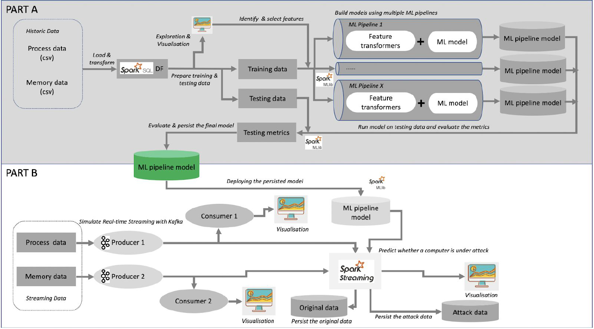

# Streaming Data - Machine Learning: Classification
## Detecting Linux system hacking activities
<br>

#### StopHacking is a start-up incubated in Monash University to develop cloud service to detect and stop computer hackers. Although they have some rule-based service to identify certain hacks, they would like to add machine learning models which can integrate with their Spark cluster to process large amounts of data and detect any potential hacks. They hired us as the Analytics Engineer to investigate the open data from the Cyber Range Labs of UNSW Canberra and build rule-based Machine Learning models based on the data to identify abnormal system behaviour. In addition, they want us to help them integrate the machine learning models into the streaming platform using Apache Kafka and Apache Spark Streaming to detect any real-time threats, in order to stop the hacking.<br><br>

## Architecture
# 

<br><i>This was an individual assignment where I scored the highest grade.</i>

<br>

## Setup

* Clone this repository into your system
```
git clone https://github.com/akale1994/Big-Data-ML-Classification.git
```
### Part A
* Make sure your Apache Spark clusters are running<br>
* Open and run the notebook
```
model_building > Assignment-2A.ipynb
```
<br>

### Part B
* Make sure your Apache Spark clusters and the Kafka server are running<br>
* Open and run the respective notebooks in the following order
```
detecting_attacks_on_streaming_data > Assignment-2B-Task1_process_producer.ipynb
```
```
detecting_attacks_on_streaming_data > Assignment-2B-Task1_memory_producer.ipynb
```
```
detecting_attacks_on_streaming_data > Assignment-2B-Task2_process_consumer.ipynb
```
```
detecting_attacks_on_streaming_data > Assignment-2B-Task2_memory_consumer.ipynb
```
```
detecting_attacks_on_streaming_data > Assignment-2B-Task3_streaming_application.ipynb
```
